<!DOCTYPE HTML PUBLIC "-//W3C//DTD HTML 4.01 Transitional//EN">

<html>
  <head>
    <meta name="generator" content="HTML Tidy for Linux/x86 (vers 11 February 2007), see www.w3.org">
    
    <link href='http://fonts.googleapis.com/css?family=Lato:400,700,400italic,700italic' rel='stylesheet' type='text/css'>
    <title>Yanbei Chen</title>
    <meta http-equiv="Content-Type" content="text/html; charset=us-ascii">

  </head>

<!-- Global site tag (gtag.js) - Google Analytics -->
  
  

  <body>
 <!-- introduction + photo -->
	<table width="850" border="0" align="center" cellpadding="20">
	<tr>
	<td> 
	<!-- <strong>Biography</strong> -->
	<table width="100%" align="center" border="0" cellpadding="10">
	  	<tr>
	    <td width="70%" valign="middle">
		
Yanbei Chen (陈彦贝）

		

					  
	                I am a final-year Ph.D. Candidate (near graduation) in Computer Science at 
	                <a href="http://www.qmul.ac.uk/">Queen Mary University of London</a>, 
	                advised by Prof. <a href = "http://www.eecs.qmul.ac.uk/~sgg/"> Shaogang Gong</a>. 
	                I received my master's degree from 
	                <a href='https://www.kth.se/en'>KTH Royal Institute of Technology</a> in Stockholm, Sweden, 
	                supervised by Prof. <a href = "http://www.csc.kth.se/~atsuto/"> Atsuto Maki </a>, 
	                and my bachelor's degree from 
	                <a href='http://www.zju.edu.cn/english/'>Zhejiang University</a> in Hangzhou, China.  
	                
					My Ph.D. research lies at the intersection of deep learning and computer vision. I focus on developing <i>semi-supervised</i>, <i>unsupervised</i>, and <i>cross-domain deep learning </i>  algorithms and techniques to tackle computer vision tasks, with the ultimate goal of advancing the automatic exploitation of large-scale visual data using minimal human supervision. I am also dedicated to researching challenging computer vision applications, such as perceiving, synthesizing humans and objects, and integrating multi-modal data to build interactive and intelligent vision systems.
		

		

		<a href="https://scholar.google.com/citations?user=u66VocEAAAAJ&hl=en"> [Google Scholar]</a>
		<a href="mailto:yanbei.chen@qmul.ac.uk"> [Email]</a>
	    <a href="https://github.com/yanbeic"> [Github]</a>
	      
		

	    </td>
	    
	    <td width="20%">
	     
	     
		
	</td>
	</tr> 
	</table>

<!-- NEWS  -->
	<table width="100%" align="center" border="0" cellspacing="0" cellpadding="20">
	<strong>News </strong>
	<tr><td>
		<ul>
		<li> One paper accepted by ECCV 2020 </li>	
		<li> Our work in CVPR 2020 is featured in 
		<a href="https://www.amazon.science/blog/how-computer-vision-will-help-amazon-customers-shop-online">Amazon blog</a>! </li>
		<li> One paper accepted by CVPR 2020 </li>
		<li> One paper accepted by AAAI 2020 </li>
		<li> One paper accepted by ICCV 2019  </li>
		<li> One paper accepted by BMVC 2018  </li>
		<li> One paper accepted by ECCV 2018  </li>
		<li> One paper accepted by ICCVW 2017  </li>
		</ul>
	</td></tr>  
	</table>

<!-- PUBLICATION  -->
	<table width="100%" align="center" border="0" cellpadding="10">
	<strong>Publications</strong>  
	<!--    -->

<!-- 	<tr>
		<td width="100%" valign="top">
		<strong> Multimodal Learning (image + text) </strong> 
		</td>
	</tr> -->

	  
	 	<!-- CVPR paper -->
		<tr>
		    <td width=90%" valign="top">
		    
		    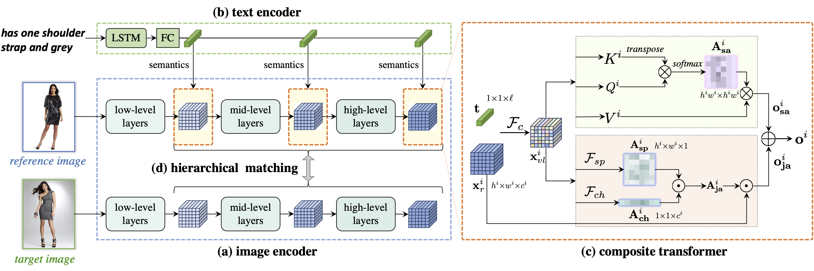
		    </td>
		</tr>
		<tr>
		    <td width="100%" valign="top">
			

              <b>Image Search with Text Feedback by Visiolinguistic Attention Learning</b>
               
              <strong>Yanbei Chen</strong>, Shaogang Gong, Loris Bazzani. 
              <i>Conference on Computer Vision and Pattern Recognition, Seattle, USA, June 2020 </i> 
               
              <a href="Doc/CVPR20-ChenY.pdf">[PDF]</a>
              <a href="Doc/CVPR20-ChenY-sup.pdf">[Supplementary]</a>
              <a href="Doc/poster/cvpr20-poster.pdf">[Poster]</a>
              <a href="https://github.com/yanbeic/VAL">[Code]</a>
              <a href="demo/cvpr20-demo.mov">[Demo]</a>
                  
			

		   	</td>
		</tr> 

		<!-- ECCV paper -->
		<tr>
		    <td width=90%" valign="top">
		    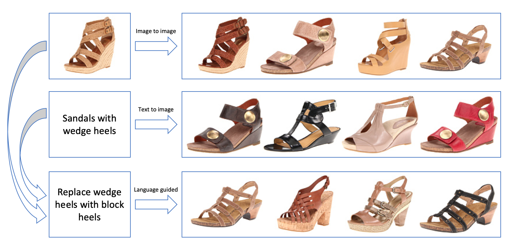
		    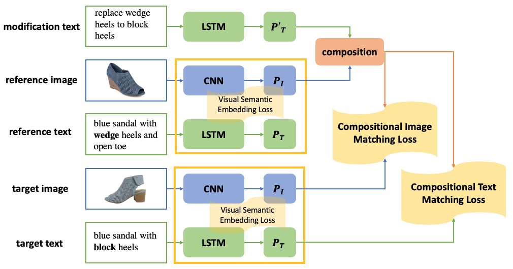
		    
		    </td>
		</tr>
		<tr>
		    <td width="100%" valign="top">
			

              <b>Learning Joint Visual Semantic Matching Embeddings for Language-Guided Retrieval</b>
               
              <strong>Yanbei Chen</strong>, Loris Bazzani. 
              <i>European Conference on Computer Vision, Online, August 2020 </i> 
               
              <a href="http://www.ecva.net/papers/eccv_2020/papers_ECCV/papers/123670137.pdf">[PDF]</a>
                  
			

		   	</td>
		</tr> 

<!-- 		<tr>
			<td width="100%" valign="top">
			<strong> Visual Learning in Limited-Label Regime </strong> 
			</td>
		</tr>
 -->
		<!-- AAAI paper -->
		<tr>
		    <td width=90%" valign="top">
		    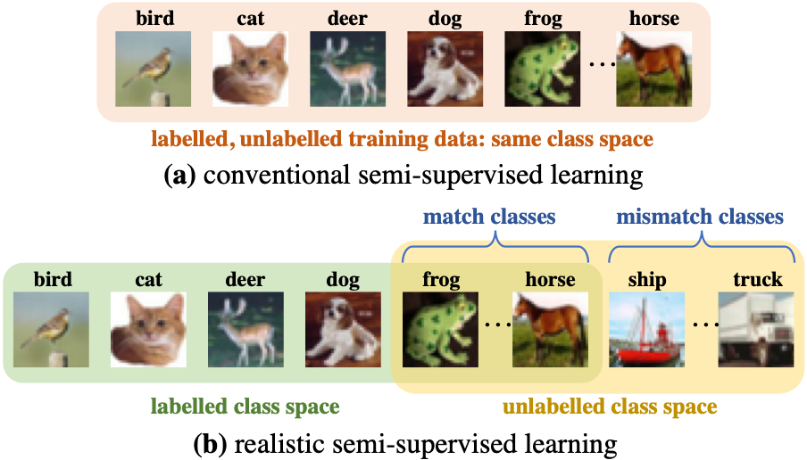
		    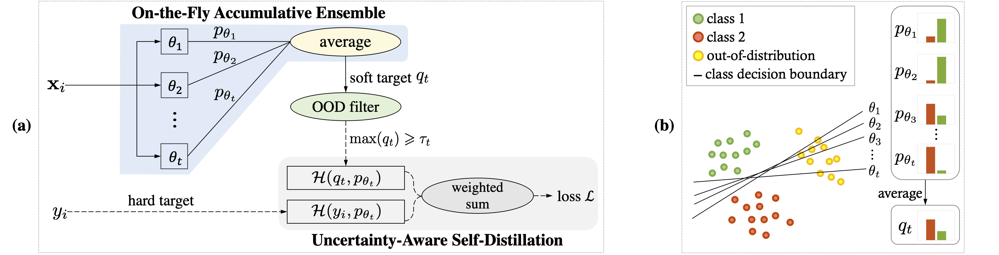
		    </td>
		</tr>
		<tr>
		    <td width="100%" valign="top">
			

              <b>Semi-Supervised Learning under Class Distribution Mismatch</b>
               
              <strong>Yanbei Chen</strong>, Xiatian Zhu, Wei Li, Shaogang Gong. 
              <i>Association for the Advancement of Artificial Intelligence, New York City, USA, February 2020 </i> 
               
              <a href="Doc/AAAI20-ChenY.pdf">[PDF]</a>
              <a href="Doc/AAAI20-ChenY-sup.pdf">[Supplementary]</a>
              <a href="Doc/poster/aaai20-poster.pdf">[Poster]</a>
              <!-- <a href="https://github.com/yanbeic/ssl-class-mismatch">[Code]</a> -->
                  
			

		   	</td>
		</tr>

		<!-- ICCV paper -->
		<tr>
		    <td width=90%" valign="top">
		    
		    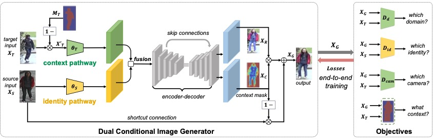
		    </td>
		</tr>
		<tr>
		    <td width="100%" valign="top">
			

              <b>Instance-Guided Context Rendering for Cross-Domain Person Re-Identification</b>
               
              <strong>Yanbei Chen</strong>, Xiatian Zhu, Shaogang Gong. 
              <i>International Conference on Computer Vision, Seoul, Korea, October 2019 </i> 
               
			  <a href="http://openaccess.thecvf.com/content_ICCV_2019/papers/Chen_Instance-Guided_Context_Rendering_for_Cross-Domain_Person_Re-Identification_ICCV_2019_paper.pdf">[PDF]</a>
              <a href=http://openaccess.thecvf.com/content_ICCV_2019/supplemental/Chen_Instance-Guided_Context_Rendering_ICCV_2019_supplemental.pdf>[Supplementary]</a>
              <a href="Doc/poster/iccv19-poster.pdf">[Poster]</a>
                  
			

		   	</td>
		</tr>

		<!-- BMVC paper -->
		<tr>
		    <td width=90%" valign="top">
		    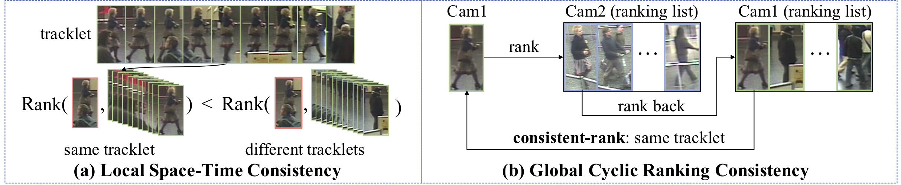
		    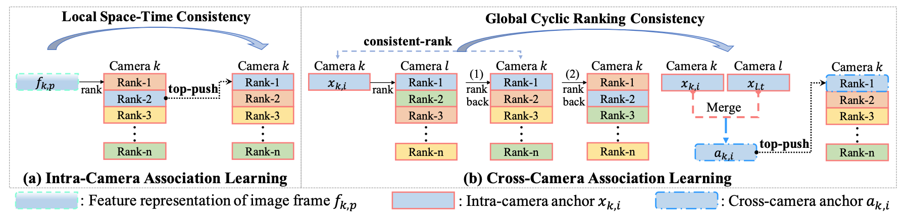
		    </td>
		</tr>
		<tr>
		    <td width="100%" valign="top">
			

              <b>Deep Association Learning for Unsupervised Video Person Re-identification</b>
               
              <strong>Yanbei Chen</strong>, Xiatian Zhu, Shaogang Gong. 
              <i>British Machine Vision Conference, Newcastle, UK, September 2018 </i> 
               
			  <a href="https://arxiv.org/pdf/1808.07301.pdf">[PDF]</a>
              <a href="Doc/poster/bmvc18-poster.pdf">[Poster]</a>
              <a href="https://github.com/yanbeic/Deep-Association-Learning">[Code]</a> 
                  
			

		   	</td>
		</tr>

		<!-- ECCV paper -->
		<tr>
		    <td width=90%" valign="top">
		    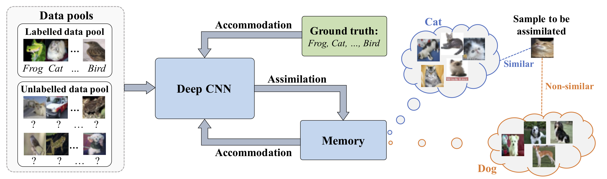
		    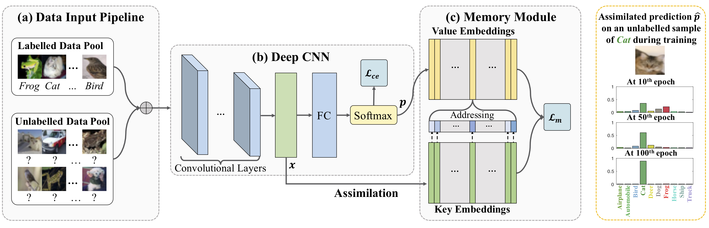
		    </td>
		</tr>
		<tr>
		    <td width="100%" valign="top">
			

              <b>Semi-supervised Deep Learning with Memory</b>
               
              <strong>Yanbei Chen</strong>, Xiatian Zhu, Shaogang Gong. 
              <i>European Conference on Computer Vision, Munich, Germany, September 2018 </i> 
               
              <a href="http://openaccess.thecvf.com/content_ECCV_2018/papers/Yanbei_Chen_Semi-Supervised_Deep_Learning_ECCV_2018_paper.pdf">[PDF]</a>
			  <a href="Doc/poster/eccv18-poster.pdf">[Poster]</a>
			  <a href="https://github.com/yanbeic/semi-memory">[Code]</a> 
                  
			

		   	</td>
		</tr>

		<tr>
			<td width="100%" valign="top">
			<strong> Person Re-Identification </strong> 
			</td>
		</tr>

		<!-- ICCVW paper -->
		<tr>
		    <td width=90%" valign="top">
		    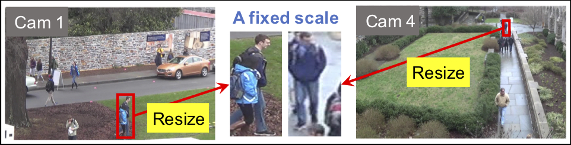
		    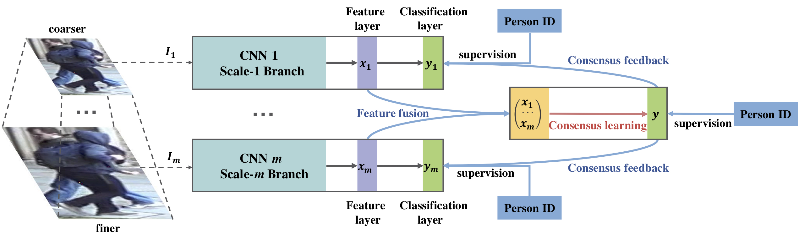
		    </td>
		</tr>
		<tr>
		    <td width="100%" valign="top">
			

              <b>Person Re-Identification by Deep Learning Multi-Scale Representations</b>
               
              <strong>Yanbei Chen</strong>, Xiatian Zhu, Shaogang Gong. 
              <i>International Conference on Computer Vision, Workshop on Cross-Domain Human Identification, Venice, Italy, October 2017 </i> 
               
              <a href="http://openaccess.thecvf.com/content_ICCV_2017_workshops/papers/w37/Chen_Person_Re-Identification_by_ICCV_2017_paper.pdf">[PDF]</a>
              <a href="Doc/slide/iccvw17-slide.pdf">[Slide]</a>
                 
              <!--    -->
			

		   	</td>
		</tr>
	
	</table>

<!-- Academic Services -->
	<table width="100%" align="center" border="0" cellpadding="20">
	<strong>Academic Services</strong>
	<tr><td>
	<ul>
	<nobr> <strong> Conference Reviewers: </strong> </nobr>
	<li><nobr> CVPR2020, NeuRIPS2020, BMVC2020/2019, ACCV2020, WACV2021, ICPR2021 </nobr></li>
	 
	<nobr> <strong> Journal Reviewers: </strong> </nobr>
	<li><nobr> IEEE Transactions on Pattern Analysis and Machine Intelligence (TPAMI) </nobr></li> 
	<li><nobr> IEEE Transactions on Image Processing (TIP) </nobr></li> 
	<li><nobr> IEEE Transactions on Circuits and Systems for Video Technology (TCSVT) </nobr></li> 
	<li><nobr> IEEE Transactions on Cybernetics </nobr></li>
	<li><nobr> Neurocomputing </nobr></li>
	<li><nobr> Pattern Recognition </nobr></li>
	</ul>
	</td></tr>  
	</table> 

<!-- Experience -->
	<table width="100%" align="center" border="0" cellpadding="20">
	<strong>Experiences</strong>
	<tr><td>
	<ul>
	<li><nobr> Research Intern at Tencent in 2020 Summer  </nobr></li>
	<li><nobr> Research Intern at Amazon Berlin in 2019 Summer  </nobr></li>
	<li><nobr> Teaching Assistant in QMUL, 2019 Spring: Deep Learning and Computer Vision (ECS795P)  </nobr></li>
	<li><nobr> Teaching Assistant in QMUL, 2018 Spring: Deep Learning and Computer Vision (ECS795P)  </nobr></li>
	</ul>
	</td></tr>  
	</table> 

